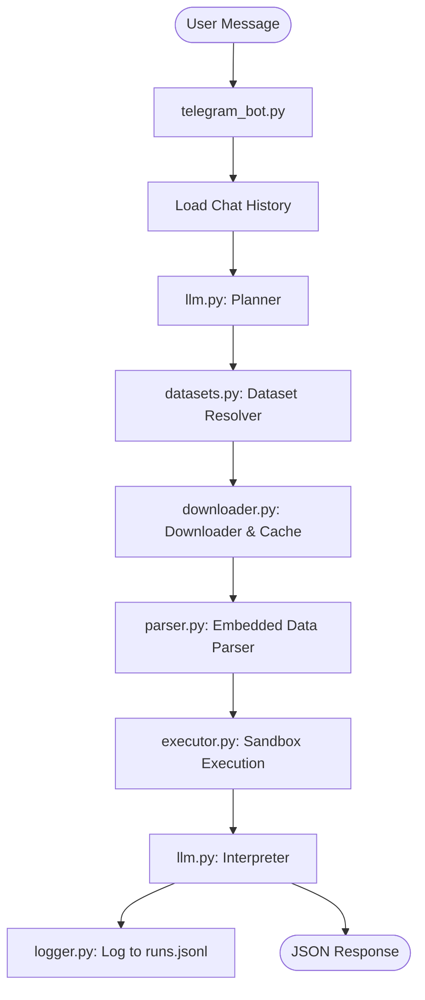

# Data Analyst Telegram Bot 🤖📈

A production-ready, LLM-powered Data Analyst Telegram Bot. This application processes natural language questions about datasets (CSV, Excel, JSON, Markdown tables, or pasted CSV text), automatically fetches and caches datasets from public URLs or catalog configurations, executes secure analytical sandboxes using **Pandas** and **DuckDB**, and responds with a strict, grading-compliant JSON structure.

It serves public audit logs at `/run.jsonl` for validation.

---

## 🏗️ Architecture

The flow of processing a request from a user:



---

## ⚙️ Configuration & Environment Variables

Create a `.env` file in the root directory (based on `.env.example`):

```ini
# OpenAI API configuration
OPENAI_API_KEY=your-openai-api-key

# Telegram Bot Token (obtained from @BotFather)
BOT_TOKEN=your-telegram-bot-token

# Base URL of the deployment (e.g. https://data-analyst.up.railway.app)
# If empty, the bot automatically runs in POLLING mode.
BASE_URL=
```

> [!IMPORTANT]
> **Port Assignment:** The application automatically binds to `0.0.0.0` and uses the port specified by the hosting platform (e.g., Railway, Render) through the `PORT` environment variable. If `PORT` is not defined, it dynamically binds to an available open port on startup.

---

## 🚀 Getting Started

### Telegram Bot Creation
1. Find [@BotFather](https://t.me/BotFather) on Telegram.
2. Send `/newbot` and follow the instructions to name your bot.
3. Copy the token generated (this is your `BOT_TOKEN`).

### Local Development (Python 3.12+)

1. **Clone the repository:**
   ```bash
   git clone <repo-url>
   cd data-analyst-bot
   ```

2. **Create a virtual environment and install dependencies:**
   ```bash
   python3 -m venv .venv
   source .venv/bin/activate
   pip install -r requirements.txt
   ```

3. **Configure Environment Variables:**
   ```bash
   cp .env.example .env
   # Add your BOT_TOKEN and OPENAI_API_KEY to .env
   ```

4. **Start the application:**
   ```bash
   python app/main.py
   ```
   *Note: Since `BASE_URL` is empty in local development, the bot will start in **polling mode** automatically.*

### Local Development with Docker

1. **Build and start services using Docker Compose:**
   ```bash
   docker-compose --env-file .env up --build
   ```

---

## 🌐 Production Deployment

### Railway Deployment (Preferred)

1. Sign in to your [Railway Dashboard](https://railway.app/).
2. Click **New Project** -> **Deploy from GitHub repo**.
3. Select your repository.
4. Add the following variables under the **Variables** tab:
   - `OPENAI_API_KEY`: `<your_openai_api_key>`
   - `BOT_TOKEN`: `<your_telegram_bot_token>`
   - `BASE_URL`: `<your_assigned_railway_public_url>` (e.g. `https://data-analyst.up.railway.app`)
5. Railway will read the `Dockerfile`, automatically bind to the assigned port, and deploy your bot in **webhook mode**.

### GitHub Deployment & CI/CD
A GitHub Actions workflow is pre-configured at `.github/workflows/deploy.yml` which triggers on every push to `main` or `master`. It will automatically:
1. Audit Python syntax code errors (linting).
2. Execute the test suite using `pytest`.
3. Validate that the Docker container builds successfully.

---

## 🤖 Telegram Behaviour & Usage

The bot supports multi-turn conversations and remembers the state across multiple messages (cleared with `/clear` or `/start`).

### Output Format
The bot responds with **exactly one JSON object and nothing else**.

```json
{
    "answer": {
        "state": "Assam"
    },
    "log_url": "https://data-analyst.up.railway.app/run.jsonl"
}
```

### Example Multi-Turn Flow
1. **User**: `Load the MOSPI unemployment dataset.`
2. **User**: `Filter only Delhi.`
3. **User**: `Calculate average for females.`

---

## 📊 Endpoints & API Reference

| Endpoint | Method | Description |
|---|---|---|
| `/` | `GET` | Health check endpoint returning platform info. |
| `/run.jsonl` | `GET` | Serves the public execution runs log (JSON Lines format) for grading audit. |
| `/telegram-webhook` | `POST` | Webhook target receiver for incoming updates from Telegram. |

---

## 🧪 Testing

Execute unit tests locally:
```bash
pytest
```
Tests verify the caching downloader, pasted table/Markdown parsers, sandbox execution environments, and Telegram handlers.

---

## 📸 Screenshots Section

*Once deployed, capture the interaction window from Telegram showing the JSON structure response and place it here!*
